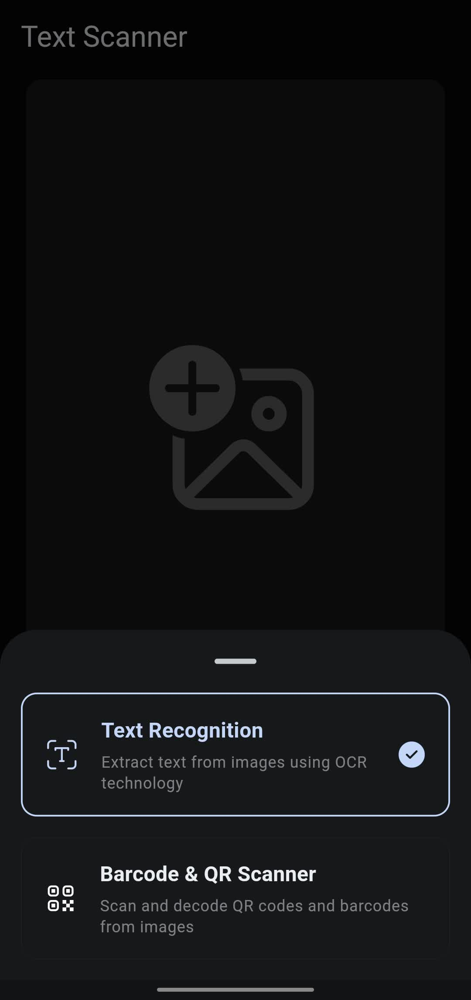
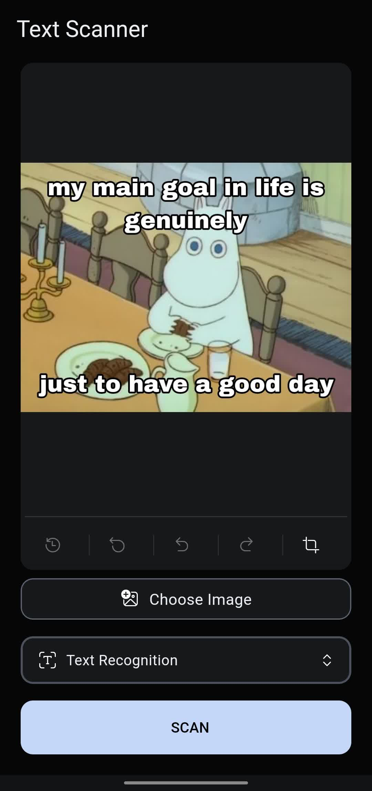

# Text Scanner

An android application that helps you quickly extract text from images and scan barcodes & QR codes.

[Get the latest release](https://github.com/blackmonk13/text_scanner/releases/latest)

## Table of Contents

- [About](#about)
- [Screenshots](#screenshots)
- [Getting Started](#getting_started)
- [Usage](#usage)

- [License](#license)

## About <a name = "about"></a>

Text Scanner is an Android application built with Flutter that leverages the power of Google's ML Kit for text recognition in images. The app provides users with an easy-to-use interface for selecting, capturing, and scanning text from images. Users can also crop and rotate images before scanning. The scanned text can be shared with others using the share functionality.

## Screenshots <a name = "screenshots"></a>

|  |  |  |
| --------------------------------- | --------------------------------- | --------------------------------- |
|  |  |  |
|  |  |  |


## Getting Started <a name = "getting_started"></a>

To get a local copy of the project up and running on your machine, follow these steps:

### Prerequisites

1. Install [Flutter](https://flutter.dev/docs/get-started/install)
2. Install [Android Studio](https://developer.android.com/studio) and set up an Android emulator or connect an Android device for testing.

### Installing

1. Clone the repository
```sh
git clone https://github.com/blackmonk13/text_scanner.git
```
2. Navigate to the project directory
```sh
cd text_scanner
```
3. Get the required packages
```sh
flutter pub get
```
4. Run the app on an Android emulator or device
```sh
flutter run
```

## Usage <a name = "usage"></a>

1. Launch the Text Scanner app on your Android device.
2. Choose an image from your gallery, capture a new one, or share an image to the app using the "Open With" menu or share menu.
3. Crop and rotate the image if needed.
4. The app will automatically scan the text from the image.
5. Share the scanned text with others using the share functionality.


## License <a name = "license"></a>

This project is licensed under the MIT License - see the [LICENSE](LICENSE) file for details.